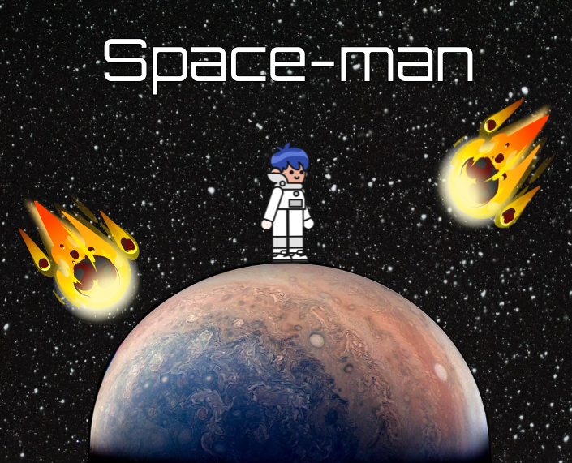
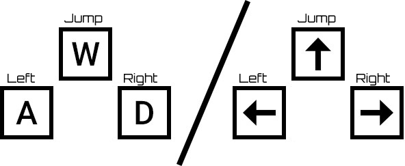
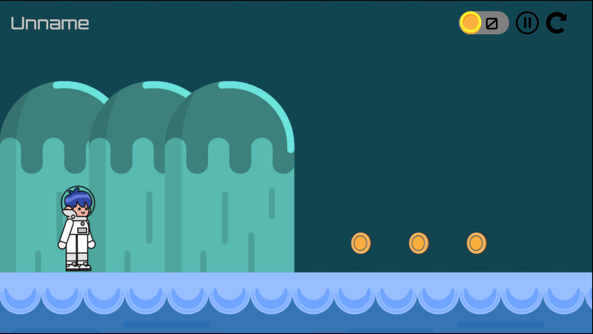
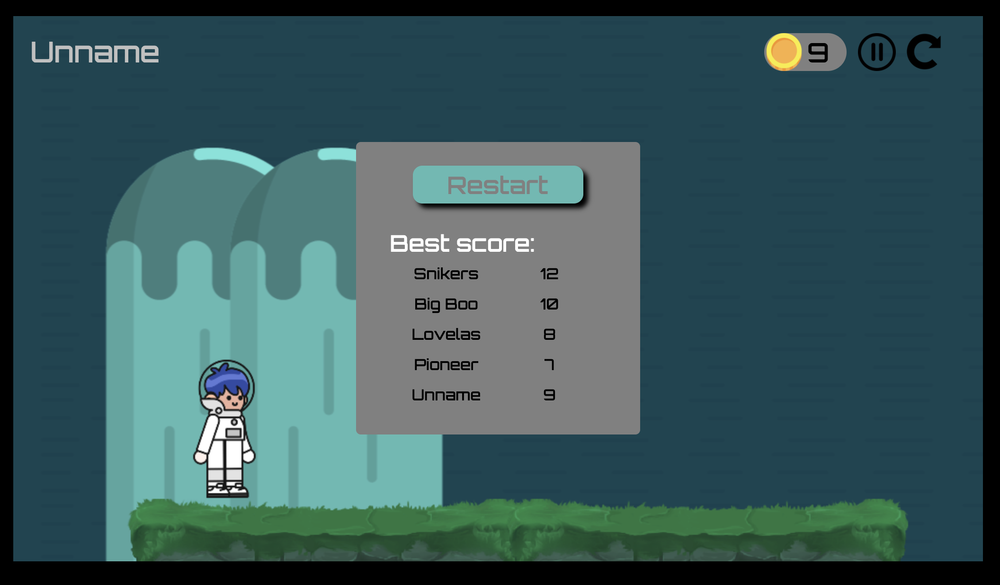

# Game- Space_Man!
### The game was implemented on Canvas.js .

## Game launch:

- git clone https://github.com/AnPodlesnyi/Frontend_game.git
- cd Frontend_game 
- npm install
- npm start
##

### The game has two levels. For these two levels, the player will have to collect all the coins and not get on the spikes.

## Control is carried out by buttons:

## Beginning of the game. 
### There is a button to exit the menu and restart.

### If the player **falls** off the platform or hits a spike, the player is automatically sent to the start of the game and their coin count is 0.

## The game has player statistics.
### Statistics are generated from the player's name and recorded in LocalStorage.
